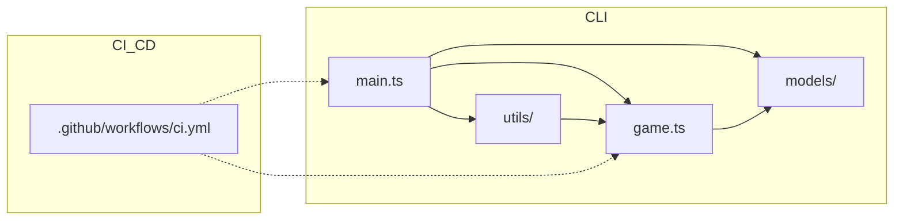

# Paso a paso del funcionamiento del sistema
1. Carga inicial de jugadores y categorías (simulada en data.ts). 
2. El usuario puede agregar jugadores y categorías desde la UI. 
3. Los ítems se pueden agregar a categorías (ej: armas, lugares, etc.). 
4. Se puede iniciar el juego si hay suficientes jugadores y categorías. 
5. Se reparte información “secreta” a los jugadores, que se muestra con alerts. 
6. Se puede ver el marcador o reiniciar la partida.

## ¿Cómo funciona?

1. Se cargan jugadores y categorías iniciales (en `src/data.ts`).
2. Podés agregar más jugadores/categorías con los botones del menú.
3. Al iniciar el juego, se reparte información secreta y se muestra a cada jugador (simulado con alert).
4. Hay un marcador de ganadores (simulado).

## ¿Cómo levantar el proyecto?

```sh
npm install
npm run dev
```

## ¿Cómo correr los tests?

```sh
npx vitest
```

## Estructura de carpetas

- `src/models`: modelos de Jugador y Categoría.
- `src/components`: componentes React.
- `src/data.ts`: datos iniciales.
- `tests/`: tests con Vitest.

---


## 1. Flujo de CI/CD

```mermaid
flowchart TD
    A[Developer Push/PR]
    B[GitHub Actions Workflow]
    C[Test: TypeScript & Lint]
    D[Build (opcional)]
    E{¿Resultado OK?}
    F[Merge/Despliegue]
    G[Notificar error al developer]
    H[Producción/Release]

    A --> B
    B --> C
    C --> D
    D --> E
    E -- Sí --> F
    E -- No --> G
    F --> H
```

## 2. Arquitectura del Juego


